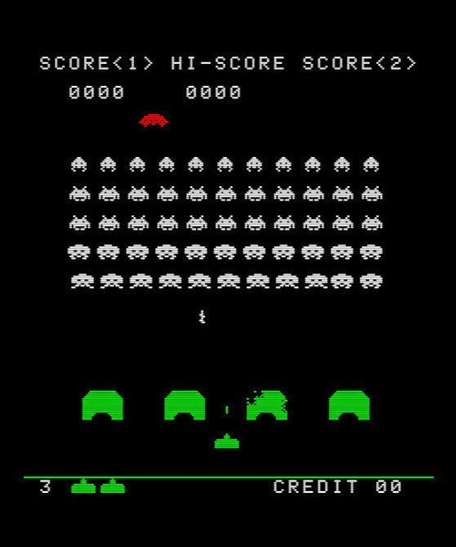
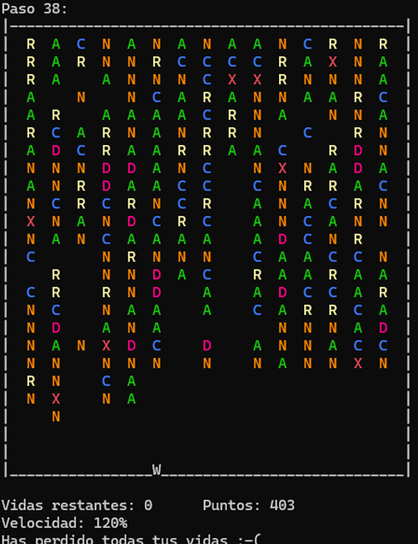

# Earth Intruders: Simulación Space Invaders en CUDA C

  

## Autores
*Guillermo González Martínez y David Romero Oñoro*

## Descripción del Proyecto
Este repositorio alberga el código fuente de la Práctica 1 (PECL1) de la asignatura **Paradigmas Avanzados de la Programación**. El proyecto consiste en el desarrollo de "Earth Intruders", un sucedáneo del clásico juego arcade *Space Invaders*, implementado íntegramente en **CUDA C** para explotar el potencial de procesamiento paralelo de las tarjetas gráficas NVIDIA (GPU).

La simulación maneja un tablero bidimensional dinámico donde hordas de alienígenas de distintos tipos descienden hacia la Tierra. A excepción del control de la nave y la representación en consola, toda la lógica de inicialización, movimiento, colisiones y transformaciones alienígenas se ejecuta paralelamente en la GPU utilizando *kernels*.

## Características Principales
* **Procesamiento Paralelo en GPU:** El 95% de la lógica del juego (generación, movimiento, ataques, colisiones) se ejecuta en la GPU utilizando CUDA, liberando a la CPU para la gestión de I/O.
* **Manejo Dinámico de Dimensiones:** Las dimensiones del tablero (filas y columnas) no son constantes estáticas; se configuran dinámicamente mediante argumentos de consola o entrada interactiva de usuario.
* **Gestión de Memoria en CUDA:** Utilización intensiva de `cudaMalloc` y `cudaMemcpy` para sincronizar los estados del tablero (`h_matriz` en Host y `d_matriz` en Device).
* **Acceso de Memoria Linealizado (1D):** Optimización del acceso a las matrices bidimensionales mapeándolas de forma plana (1D) usando operaciones como `threadIdx.x + blockIdx.x * blockDim.x`.
* **Ejecución Múltiples Bloques:** Configuración avanzada del grid de ejecución (`dimGrid` y `dimBlock`) para despachar hilos a través de múltiples Multiprocesadores (SM), comprobando dinámicamente las limitaciones del hardware (`cudaDeviceProp`).
* **Uso Experimental de Memoria Compartida (`__shared__`):** Implementación de "teselas" (tiles) en memoria compartida para la detección rápida de adyacencias en las transformaciones alienígenas (Nubes y Cefalópodos).

## Dinámica del Juego y Comportamiento CUDA
El bucle principal del juego respeta un orden de ejecución estricto implementado mediante sucesivas llamadas a kernels:
1. `inicializarMatriz`: Genera el tablero vacío, la nave en la última fila, obstáculos aleatorios (con restricciones) y los distintos tipos de alienígenas utilizando la librería `cuRAND`.
2. `reconvertir_cefalopodo` / `reconvertir_nube`: Kernels que analizan la vecindad inmediata de ciertos alienígenas en paralelo (implementación con Memoria Compartida por bloques).
3. `reconvertir_comandante`: Evalúa estados especiales antes del descenso.
4. `descensoYDesintegracion`: Controla la caída de los alienígenas y gestiona los impactos (explosiones en radio) contra obstáculos y la nave utilizando un sistema de probabilidad paralelo.
5. `comprobarSuelo`: Actualiza contadores de vidas y puntuación si la invasión alcanza la última línea.

## Interfaz Gráfica (Consola) y Modos de Ejecución
A pesar de operar en la terminal, la salida ha sido altamente estilizada usando secuencias de escape ANSI (códigos de color) para representar los diferentes actores:
* **Alien A:** Verde
* **Nube N:** Naranja
* **Cefalópodo C:** Azul
* **Destructor D:** Rosa
* **Crucero R:** Amarillo
* **Comandante X:** Rojo

**Modos de Ejecución:**
* **Manual (`-m`):** El usuario controla la nave y avanza el turno.
* **Automático (`-a`):** La simulación avanza por sí sola, aumentando la velocidad de descenso (20%) cada vez que el enjambre avanza un número de pasos igual a la altura del tablero.

  

